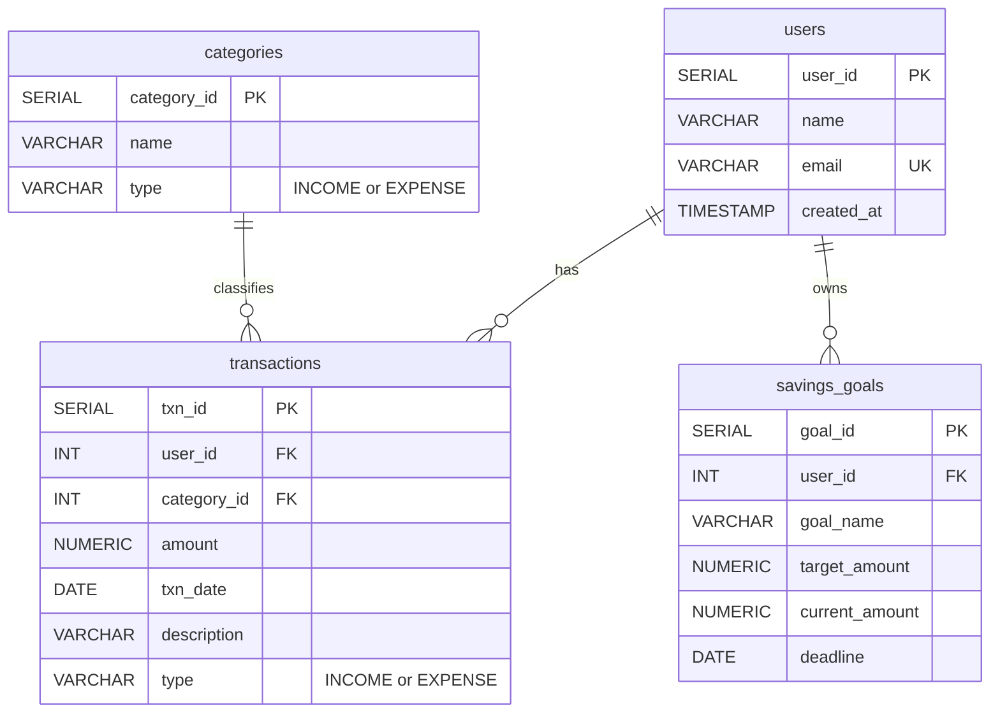

# SmartBudget ER Diagram (F002)

Entity-relationship model for the Day 1 schema in `db/create_tables.sql`.

## Relationships

| Parent | Child | Cardinality | Foreign key |
|--------|-------|-------------|-------------|
| `users` | `transactions` | 1:N | `transactions.user_id` → `users.user_id` |
| `categories` | `transactions` | 1:N | `transactions.category_id` → `categories.category_id` |
| `users` | `savings_goals` | 1:N | `savings_goals.user_id` → `users.user_id` |

## Notes

- `categories.type` and `transactions.type` are restricted to `INCOME` / `EXPENSE`.
- `transactions.amount` and `savings_goals.target_amount` must be greater than zero.
- `users.email` is unique across all users.
